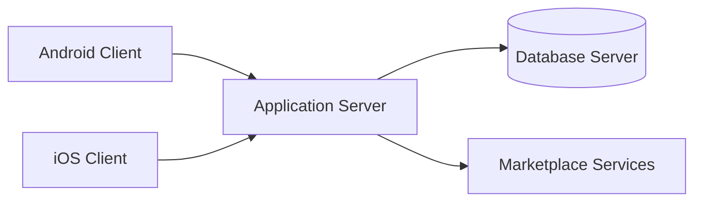
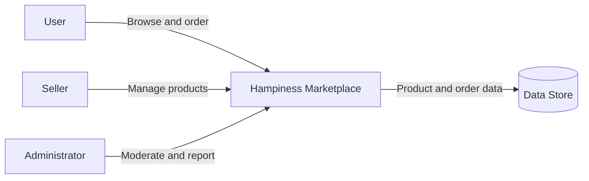

# Hampiness — Information System Design

Hampiness is an academic team project that translated the needs of a marketplace into a structured information-system proposal before implementation.

## Project type and role

- **Type:** Academic team project
- **Role:** Team member — system analysis and design
- **Focus:** Requirements, process modeling, object modeling, and architecture

## Analysis and design work

- Fishbone analysis to explore root causes and business problems
- Context and level-0 data-flow diagrams
- Use-case modeling for user interactions
- Class diagrams for system structure
- Sequence diagrams for interaction flow
- Activity diagrams for business processes
- A proposed three-tier client/server architecture

## Proposed architecture

The client layer presents the mobile experience, the application layer handles business logic and validation, and the data layer manages persistent marketplace information. Separating these responsibilities supports maintainability, security, and future scalability.

## Example process view

## Learning outcomes

This project strengthened my ability to move from an ambiguous business problem to traceable requirements and a maintainable system design. It also showed me how process, data, user interaction, and physical architecture must remain consistent with one another.

## Privacy note

The original submission document is not included because it contains student identifiers and collaborator information. This repository is a sanitized portfolio summary of the project.

